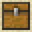

# BTGen

> A Minecraft datapack to emulate buried treasure placement

To place a buried treasure structure, run `/function sp.buried_treasure:place`

Additional config can be accessed with the scoreboard `sp.treasure`:

| score        | 0                          | 1                                           | default |
|--------------|----------------------------|---------------------------------------------|---------|
| align_xz     | Generates at exact x and z | Generates at (9,9) within the current chunk | 1       |
| align_y      | Generates at exact y       | Generates starting from Y: 90               | 1       |
| match_biomes | Can generate in any biome  | Will only generate in beach biomes          | 1       |
